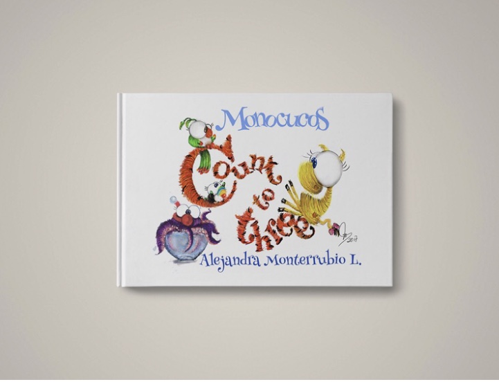
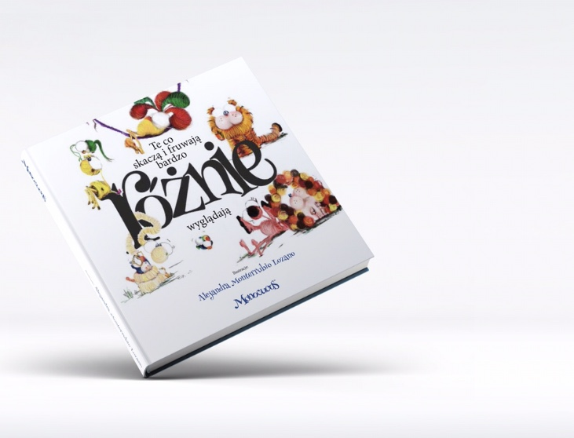

## COUNT TO THREE

### •English Version

## DIFERENCIA EN LA APARIENCIA

### •Spanish Version

### •Polish Version

# SALES 

## info@monocucos.com

<a href="#" class="btn">BACK TO TOP</a>

## Notices
### **SOON!**    DIFERENCIA EN LA APARIENCIA   (english version)
{: .notice}
