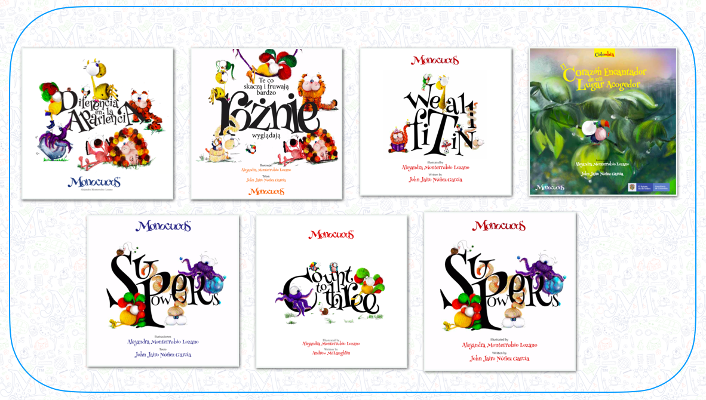
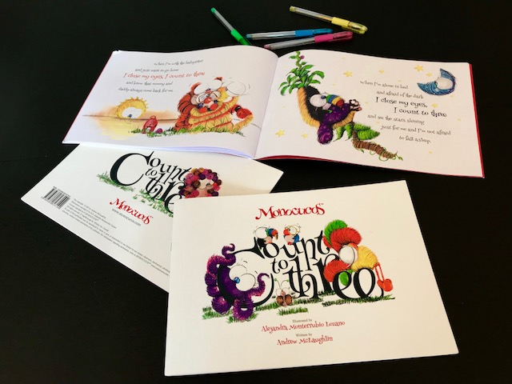

### Read more. Be happy.
The literary work of the Monocucos project is developed in three different languages (English, Spanish and Polish) and is present in at least 5 countries. Distribution agreements for Canada and the US are already being signed.

## COUNT TO THREE

### "COUNT TO THREE" The book is a colourful and fun way to teach kids how to deal with stress and develop both coping mechanisms and resiliency. The book shows young children (and adults) that with a little imagination and perspective we can overcome our fears.

*"Count to Three is a delightful and beautifully illustrated story of reassurance for children. The situations in the book are all examples of children’s fears during childhood. As a parent who’s child has encountered all of these little apprehensions, Count to Three is one of those feel good books for both of us! "*

**CHRISTINE COX**
Early Childhood Education Professor

•Available in: English Version / 21cm x 29,7 (A4) / soft cover / color
{: .notice}

## DIFERENCIA EN LA APARIENCIA

### This Book is about inclusion and acceptance. About find the great value of being unique and different.
 •Available in: Spanish Version and Polish Version / 21cm x 21cm / 40 p. / soft cover / color
{: .notice}

## SUPER POWERS

•Available in: English Version and Spanish Version / 21cm x 21 cm / 40 p. / soft cover / color
{: .notice}

# SALES 

## info@monocucos.com

<a href="#" class="btn btn-success">BACK TO TOP</a>

## Notices
### **SOON!**    DIFERENCIA EN LA APARIENCIA   (english version)
{: .notice}
