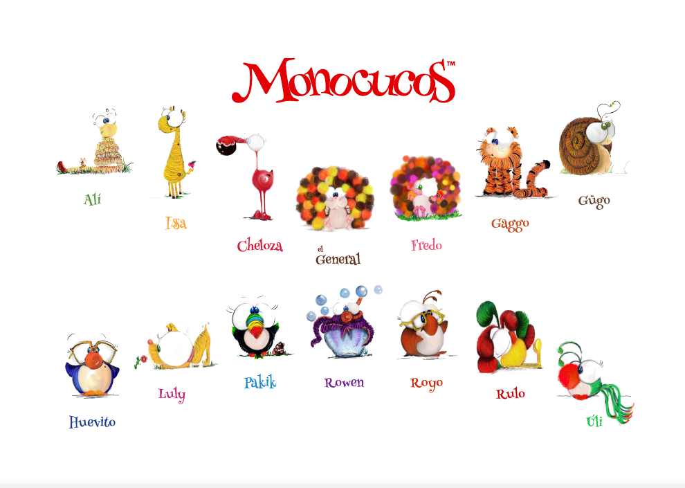

# "A world for all where we are all one".

# "Un mundo para todos donde todos somos uno".
 
# "Jeden świat dla wszystkich gdzie wszyscy jesteśmy jednym światem".

**Together we have the Power to change the world.**
  
MONOCUCOS is an amazing family of 14 that will teach you how to have fun because they all are different. We talk about values, like **inclusion, diversity, tolerance, individuality, acceptance, and love**.

### Our Family

* Gaggo
* Alí
* Huevito
* Luly
* El General
* Cheloza
* Rulo
* Royo
* Issa
* Úli
* Gügo
* Pakik
* Fredo
* Rowen

<a href="#" class="btn btn-success">BACK TO TOP</a>

## Notices

**Follow us!** Facebook:Monocucos, Instagram:@losmonocucos, Twitter:@losmonocucos
{: .notice}
