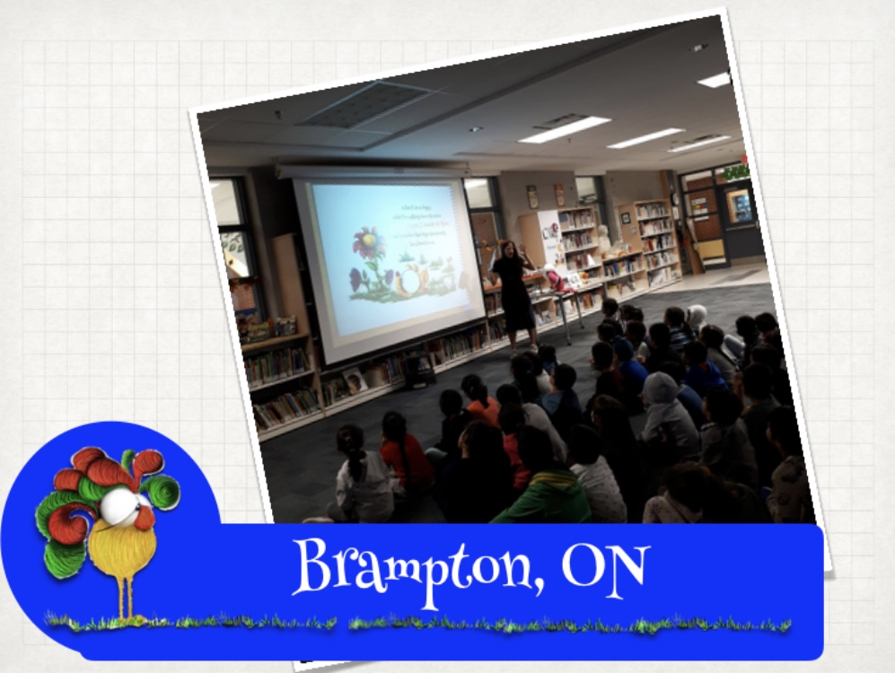
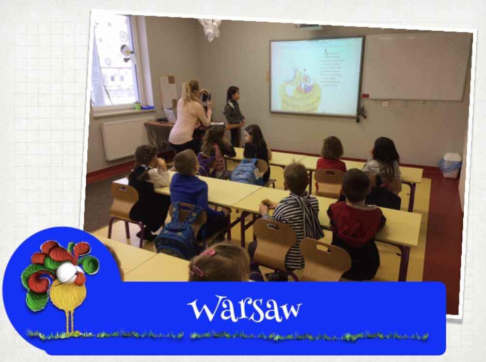
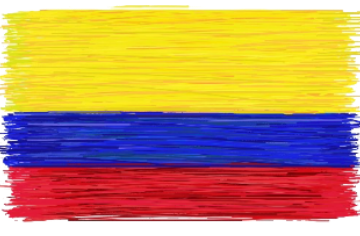
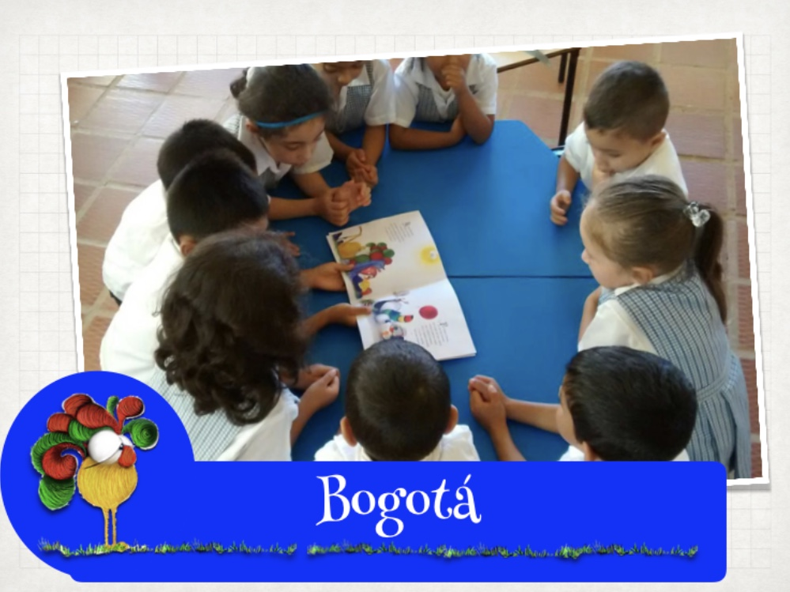
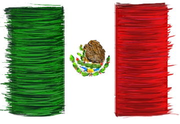
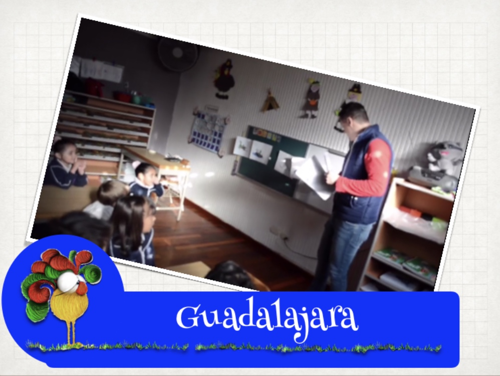

## Changing the world around the world

Coaching for kids about individuality, diversity, differences and tolerance.

# CANADA

### click to watch the video

# POLAND

# COLOMBIA

# MÉXICO

<a href="#" class="btn btn-success">BACK TO TOP</a>

## Notices

**Watch out!** You can also add notices by appending `{: .notice}` to a paragraph.
{: .notice}
