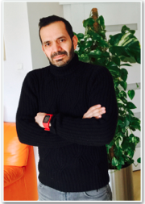

 

## ALEJANDRA MONTERRUBIO

Ilustrator, grafik, artystka meksykańska mieszkająca w Kanadzie. Jej wielokulturowa postać żyjąca w mocno zdywersyfikowanym społeczeństwie Kanady była źródłem powstania Monocucos.

## JOHN NÚÑEZ

Publicysta kolumbijski mieszkający w Polsce, miłośnik pisania. Jego profil zawodowy ukształtował się przez tworzenie tekstów, nadzór nad kreacją i opracowywaniem strategii komunikacji w agencjach reklamowych Ameryki Łacińskiej i Europy.

<a href="#" class="btn btn-success">BACK TO TOP</a>

## Notices

**Follow us!** Facebook:Monocucos, Instagram:@losmonocucos, Twitter:@losmonocucos
{: .notice}

