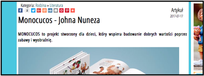

## Changing the world around the world

### "Beryl Ford School" (Canada)
<https://whitby.snapd.com/events/view/1102320>

<https://www.youtube.com/watch?v=aZwHni_mAnk>

### "Gala" (Poland)

### "Ser Padres Hoy" (Colombia)

<https://kobietamag.pl/ksiazeczka-dla-dzieci-monocucos/>

<http://kochanamama.pl/artykul/monocucos_johna_nuneza>

<https://beautytester.pl/beauty_news/monocucos-ksiazeczka-o-tolerancji-dla-dzieci/>

<http://www.claudia.pl/monocucos>

<http://www.kobieta.pl/artykul/monocucos-edukacyjny-projekt-o-roznorodnosci-wkrotce-w-polsce>

<a href="#" class="btn btn-success">BACK TO TOP</a>

