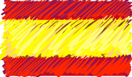

We are a children's

We are a children's project created to implement values though fun and imagination. Our messages focus on tolerance and social acceptance; we want to become the starting point of a new way of thinking, communicating the invaluable impact that being accepting can heavily influence the construction of a better future society.

We see acceptance through individuality, diversity, our differences and tolerance.

We do not see a world in which one is to be black or white.

Our language is that of colours and what they tell us:
Difference, complement, emotions, tones, signs and languages.

Monocucos are "Acceptance in Colours".

An acceptance which allows us to see new combinations for expressing worlds filled with nuances.

We are looking to  spread our message to as many children as possible. We are more than sure that our philosophy can become an important tool to help the formation of a child since a young age, and while growing, he or she can become a true advocate for change in society.
 
 

  

Somos un proyecto infantil desarrollado para el fomento de valores a través de la diversión y la imaginación. Nuestros mensajes se enfocan en la tolerancia y la aceptación de la diversidad.   Queremos convertirnos en el punto inicial de un nuevo pensamiento,  comunicando el invaluable aporte que la Aceptación le puede dar a la construcción de una mejor sociedad en el futuro.

Vemos la aceptación a partir de la individualidad, la diversidad, las diferencias y la tolerancia.

No vemos un mundo en el que se tenga que ser o blanco o negro.

Nuestro lenguaje son los colores y todo lo que ellos comunican:

Mezcla, complemento, emociones, tonos, signos, lenguajes

 

LOS MONOCUCOS son ACEPTACIÓN EN COLORES

 

Una aceptación que permite ver nuevas combinaciones para expresar mundos llenos de matices

Buscamos llevar nuestro mensaje  a la mayor cantidad de niños posibles. Estamos seguros que nuestra filosofía puede convertirse en una herramienta para ayudar a la formación de niños desde temprana edad., ya que éste al crecer puede ser un verdadero generador de un cambio en la sociedad.
  

  
  
  
<a href="#" class="btn btn-success">BACK TO TOP</a>

  
